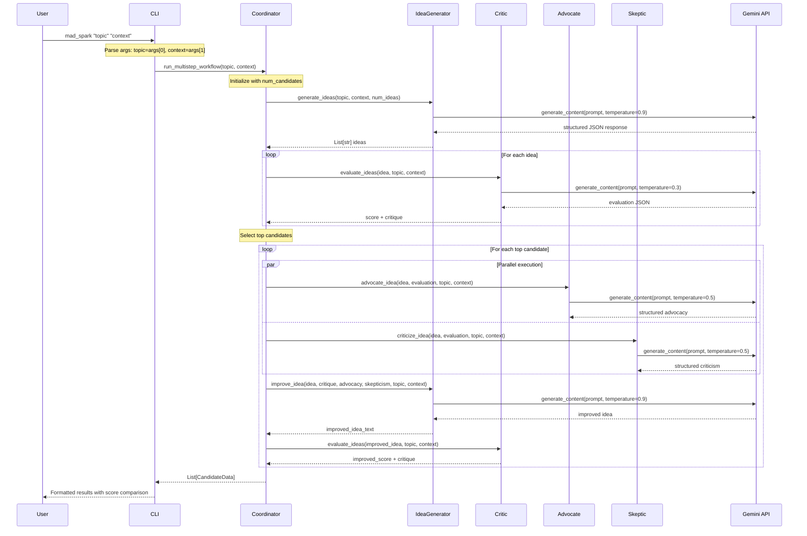

# 📐 MadSpark Multi-Agent System Architecture

## 📌 Goal & Scope

### Purpose
This document serves as the **single source of truth** for the MadSpark Multi-Agent System architecture. It aims to:
- Prevent confusion and mistakes (especially parameter naming)
- Enable efficient development and debugging
- Support onboarding of new developers and AI assistants
- Document design decisions and trade-offs

### Scope
- Complete system architecture and component relationships
- Data flow and parameter contracts
- External integrations and dependencies
- Performance and resilience patterns
- Testing and deployment strategies

### Target Audience
- Developers maintaining and extending the system
- AI assistants (Claude, GitHub Copilot, etc.) working with the codebase
- DevOps engineers deploying the system
- Product managers understanding capabilities

## 🗺️ System Context

```
┌─────────────────────────────────────────────────────────────────────┐
│                        External Systems                              │
├─────────────────────────┬───────────────────────────────────────────┤
│   Google Gemini API     │          User Interfaces                  │
│   - Text Generation     │  - CLI (mad_spark command)               │
│   - Structured Output   │  - Web UI (React + TypeScript)           │
│   - Token Tracking      │  - REST API (FastAPI)                    │
└────────┬────────────────┴────────────┬──────────────────────────────┘
         │                             │
         ▼                             ▼
┌─────────────────────────────────────────────────────────────────────┐
│                    MadSpark Core System                              │
├─────────────────────────┬───────────────────────────────────────────┤
│   Coordinators          │          Agents                           │
│   - Regular (sync)      │  - IdeaGenerator (creates ideas)         │
│   - Async (concurrent)  │  - Critic (evaluates ideas)             │
│   - Batch (optimized)   │  - Advocate (supports ideas)            │
│                         │  - Skeptic (challenges ideas)           │
├─────────────────────────┼───────────────────────────────────────────┤
│   Enhanced Reasoning    │          Utilities                        │
│   - LogicalInference    │  - TemperatureControl                   │
│   - MultiDimEvaluation  │  - NoveltyFilter                        │
│   - ContextMemory       │  - BookmarkSystem                       │
└─────────────────────────┴───────────────────────────────────────────┘
         │                             │
         ▼                             ▼
┌─────────────────────────────────────────────────────────────────────┐
│                        Data Storage                                  │
├─────────────────────────┬───────────────────────────────────────────┤
│   Local Files           │          Cache Systems                    │
│   - bookmarks.json      │  - LRU Memory Cache                     │
│   - .env config         │  - Redis (optional)                     │
│   - sample_batch.csv    │  - Response Cache                       │
└─────────────────────────┴───────────────────────────────────────────┘
```

## 🏷️ Key Use Cases

### 1. Basic Idea Generation
**User Goal**: Generate creative ideas for a given topic with constraints
```bash
mad_spark "sustainable urban farming" "low-cost, scalable solutions"
```
**Flow**: CLI → Coordinator → IdeaGenerator → Critic → Display Results

### 2. Enhanced Feedback Loop
**User Goal**: Generate ideas, get feedback, and improve them
```bash
mad_spark "AI in education" "accessible to all" --enhanced-reasoning
```
**Flow**: CLI → Coordinator → IdeaGenerator → Critic → Advocate/Skeptic → IdeaGenerator (improve) → Critic → Display Comparison

### 3. Batch Processing
**User Goal**: Process multiple idea requests efficiently
```bash
mad_spark --batch ideas.csv --output results.json
```
**Flow**: CLI → BatchCoordinator → Parallel Agent Calls → Aggregated Results

### 4. Async Web Interface
**User Goal**: Real-time progress updates while generating ideas
**Flow**: Web UI → WebSocket → AsyncCoordinator → Progress Events → UI Updates

### 5. Mock Mode Testing
**User Goal**: Test system without API costs
```bash
MADSPARK_MODE=mock mad_spark "test topic" "test context"
```
**Flow**: CLI → Coordinator → Mock Agents → Predictable Results

## 🔄 Detailed Data Flow

### Complete Workflow with Parameter Names



## 🗂️ Critical Glossary (PREVENT PARAMETER CONFUSION)

### Parameter Standardization Map

| Old Parameter | New Parameter | Component | Description | Example |
|---------------|---------------|-----------|-------------|---------|
| `theme` | `topic` | All components | Main subject or theme | "sustainable farming" |
| `constraints` | `context` | All components | Additional criteria/constraints | "low-cost, scalable" |
| `num_ideas` | `num_candidates` | Coordinators | Number of ideas to generate | 5 |
| `num_top_candidates` | `num_top_candidates` | Coordinators | Top ideas to process | 2 |

### Critical Function Signatures

```python
# ⚠️ ADVOCATE & SKEPTIC: Both need topic AND context
def advocate_idea(
    idea: str,           # The idea text
    evaluation: str,     # Critic's evaluation
    topic: str,          # Main topic (REQUIRED)
    context: str,        # Constraints (REQUIRED)
    temperature: float = 0.5,
    use_structured_output: bool = True
) -> str

def criticize_idea(
    idea: str,           # The idea text  
    advocacy: str,       # Prior evaluation/advocacy
    topic: str,          # Main topic (REQUIRED)
    context: str,        # Constraints (REQUIRED)
    temperature: float = 0.5,
    use_structured_output: bool = True
) -> str

# ⚠️ IDEA GENERATOR: Different signatures for different functions
def generate_ideas(
    topic: str,          # Main topic
    context: str,        # Constraints
    num_ideas: int = 10,
    temperature: float = 0.9
) -> str

def improve_idea(
    original_idea: str,
    critique: str,
    advocacy_points: str,
    skeptic_points: str,
    topic: str,          # Main topic
    context: str,        # Constraints
    temperature: float = 0.9
) -> str

def evaluate_ideas(
    ideas: str,
    topic: str,          # Main topic
    context: str,        # Constraints
    temperature: float = 0.3,
    use_structured_output: bool = True
) -> str
```

### Batch Function Signatures

```python
# Batch functions for reduced API calls
def advocate_ideas_batch(
    ideas_with_evaluation: List[Dict[str, str]],  # List of {"idea": str, "evaluation": str}
    topic: str,          # Main topic
    context: str,        # Constraints
    temperature: float = 0.5
) -> Tuple[List[Dict[str, Any]], int]  # (results, token_count)

def criticize_ideas_batch(
    ideas_with_advocacy: List[Dict[str, str]],  # List of {"idea": str, "advocacy": str}
    topic: str,          # Main topic
    context: str,        # Constraints
    temperature: float = 0.5
) -> Tuple[List[Dict[str, Any]], int]  # (results, token_count)

def improve_ideas_batch(
    ideas_with_feedback: List[Dict[str, str]],  # List of {"idea": str, "critique": str, "advocacy": str, "skepticism": str}
    topic: str,          # Main topic
    context: str,        # Constraints
    temperature: float = 0.9
) -> Tuple[List[Dict[str, Any]], int]  # (results, token_count)
```

## 📦 Component Architecture

### Agent Components

#### IdeaGenerator (`src/madspark/agents/idea_generator.py`)
**Purpose**: Generate creative ideas and improve existing ones based on feedback

**Key Functions**:
1. `generate_ideas()` - Initial idea generation
2. `improve_idea()` - Enhance ideas based on feedback
3. `improve_ideas_batch()` - Batch improvement for efficiency

**LLM Prompts**:
```python
# System instruction for idea generation
system_instruction = """You are a creative AI assistant specialized in generating innovative ideas.
Focus on practical, implementable solutions that match the given constraints."""

# User prompt template
prompt = f"""Generate {num_ideas} innovative ideas for: {topic}
Constraints/Context: {context}
Return as JSON array with title and description."""
```

**Error Handling**:
- JSON parsing fallbacks with regex
- Empty response returns empty list
- Malformed JSON logged and skipped

#### Critic (`src/madspark/agents/critic.py`)
**Purpose**: Evaluate ideas objectively based on given criteria

**LLM Prompts**:
```python
system_instruction = """You are an expert evaluator. 
Assess ideas based on feasibility, innovation, and alignment with constraints.
Be constructive but honest. Score from 0-10."""
```

**Structured Output Schema**:
```python
{
    "score": float,  # 0-10
    "strengths": List[str],
    "weaknesses": List[str],
    "suggestions": List[str]
}
```

#### Advocate (`src/madspark/agents/advocate.py`)
**Purpose**: Build a strong case for why an idea should be pursued

**Critical Note**: Requires BOTH `topic` AND `context` parameters

**LLM Prompts**:
```python
system_instruction = """You are an enthusiastic advocate.
Highlight strengths, opportunities, and potential impact.
Use structured bullet points for clarity."""
```

#### Skeptic (`src/madspark/agents/skeptic.py`)
**Purpose**: Identify risks, challenges, and potential issues

**Critical Note**: Requires BOTH `topic` AND `context` parameters

**LLM Prompts**:
```python
system_instruction = """You are a thoughtful skeptic.
Identify risks, challenges, and missing considerations.
Be constructive - aim to improve, not destroy."""
```

### Coordinator Components

#### Regular Coordinator (`src/madspark/core/coordinator.py`)
**Purpose**: Synchronous orchestration of the multi-agent workflow

**Key Methods**:
- `run_multistep_workflow()` - Main entry point
- `process_candidates()` - Handle top candidates
- `generate_ideas_with_novelty()` - Apply novelty filtering

**Workflow Steps**:
1. Generate initial ideas
2. Evaluate with Critic
3. Select top candidates
4. Get Advocate/Skeptic feedback
5. Improve ideas
6. Re-evaluate improvements
7. Return complete results

#### Async Coordinator (`src/madspark/core/async_coordinator.py`)
**Purpose**: Asynchronous processing with real-time progress updates

**Key Features**:
- WebSocket progress events
- Concurrent agent calls
- Timeout handling per stage
- Graceful degradation on failures

**Critical Method**:
```python
async def _process_single_candidate(
    self,
    candidate: EvaluatedIdea,
    topic: str,              # Main topic
    advocacy_temp: float,
    skepticism_temp: float,
    idea_temp: float = 0.9,
    eval_temp: float = 0.3,
    context: str = "",       # Constraints
    multi_dimensional_eval: bool = False,
    reasoning_engine = None
) -> Optional[CandidateData]
```

#### Batch Coordinator (`src/madspark/core/coordinator_batch.py`)
**Purpose**: Optimized batch processing to reduce API calls

**Optimization Strategy**:
- Single API call for all advocates (instead of N calls)
- Single API call for all skeptics
- Single API call for all improvements
- 50% reduction in API calls
- 45% cost savings

### Enhanced Reasoning System

#### LogicalInferenceEngine (`src/madspark/utils/logical_inference_engine.py`)
**Purpose**: Add logical reasoning capabilities to idea evaluation

**Inference Types**:
- `FULL_REASONING` - Complete analysis
- `CAUSAL_CHAIN` - Cause-effect relationships
- `CONSTRAINT_SATISFACTION` - Verify constraints met
- `CONTRADICTION_DETECTION` - Find conflicts
- `IMPLICATION_ANALYSIS` - Downstream effects

#### MultiDimensionalEvaluator (`src/madspark/core/enhanced_reasoning.py`)
**Purpose**: Evaluate ideas across multiple dimensions

**Dimensions**:
1. Innovation (0-10)
2. Feasibility (0-10)
3. Impact (0-10)
4. Scalability (0-10)
5. Sustainability (0-10)
6. Cost-effectiveness (0-10)
7. Risk level (0-10)

## 🔐 Security & API Management

### API Key Management
```bash
# Best Practices
1. Never commit API keys
2. Use .env file (in .gitignore)
3. Set via environment: export GOOGLE_API_KEY="..."
4. Use mad_spark config for interactive setup
```

### Mock Mode
```python
# Activated when:
- MADSPARK_MODE=mock
- No API key present
- CI environment detected

# Behavior:
- Returns predictable test data
- No external API calls
- Consistent results for testing
```

## 📈 Performance Architecture

### Batch Processing Optimization
```
Traditional: O(N) API calls
├── Advocate 1 → API Call 1
├── Advocate 2 → API Call 2
└── Advocate N → API Call N

Optimized: O(1) API calls
└── All Advocates → Single Batch API Call
```

### Caching Strategy
1. **LRU Memory Cache** - Recent API responses
2. **Redis Integration** - Distributed caching (optional)
3. **Response Deduplication** - Avoid redundant calls

### Token Usage Tracking
```python
# Tracked metrics:
- Input tokens per request
- Output tokens per request
- Total tokens per workflow
- Cost estimation
- Rate limit monitoring
```

## ♻️ Resilience Patterns

### Retry Logic
```python
# Configuration per agent:
max_retries = 3
initial_delay = 1.0  # seconds
exponential_base = 2.0
max_delay = 30.0

# Example: 1s → 2s → 4s (capped at 30s)
```

### Timeout Handling
| Operation | Timeout | Fallback |
|-----------|---------|----------|
| Idea Generation | 30s | Return partial results |
| Evaluation | 30s | Default score 5.0 |
| Advocacy | 30s | Generic positive message |
| Skepticism | 30s | Generic concerns |
| Improvement | 45s | Return original idea |

### Circuit Breaker
```python
# After 5 consecutive failures:
- Switch to fallback mode
- Log error metrics
- Attempt recovery after 60s
```

## ✅ Testing Architecture

### Test Organization
```
tests/
├── unit/           # Individual components
├── integration/    # Component interactions
├── e2e/           # Full workflows
└── performance/   # Load and speed tests
```

### Mock Strategies
1. **Agent Mocks** - Predictable responses
2. **API Mocks** - No external calls
3. **Time Mocks** - Consistent timestamps
4. **Random Mocks** - Deterministic "randomness"

### CI Pipeline
```yaml
stages:
  - syntax_check    # Ruff, mypy
  - unit_tests     # Fast, isolated
  - integration    # Component interaction
  - e2e_tests     # Full workflows
  - performance   # Speed benchmarks
```

## 📝 Architecture Decision Records

### ADR-001: Both Topic and Context for Advocate/Skeptic
**Date**: 2025-08-06
**Status**: Implemented
**Decision**: Advocate and Skeptic functions require both topic and context parameters
**Rationale**: Provides complete information for nuanced feedback
**Consequences**: More parameters to manage, but richer responses

### ADR-002: Parameter Standardization (theme→topic)
**Date**: 2025-08-05
**Status**: Implemented
**Decision**: Standardize on "topic" and "context" throughout codebase
**Rationale**: Consistency prevents confusion and errors
**Consequences**: Breaking change requiring migration

### ADR-003: Structured Output Adoption
**Date**: 2025-07-20
**Status**: Implemented
**Decision**: Use Gemini's structured output for JSON responses
**Rationale**: More reliable than parsing free-form text
**Consequences**: Cleaner code, better error handling

## 🚑 Common Issues & Solutions

### Issue: "Undefined topic variable in async_coordinator"
**Symptom**: Gemini reviewer reports undefined variable
**Cause**: Missing topic parameter in function calls
**Solution**: Ensure advocate/skeptic calls include both topic and context

### Issue: "Timeout in production but not development"
**Symptom**: Agent calls timeout after 30s
**Cause**: Complex prompts or slow API response
**Solution**: 
1. Increase timeout for specific operations
2. Simplify prompts
3. Use batch operations

### Issue: "Mock mode returns None"
**Symptom**: Tests fail with None responses
**Cause**: Mock mode not properly initialized
**Solution**: Set MADSPARK_MODE=mock before imports

## 🏗️ Deployment & Infrastructure

### Local Development Setup
```bash
# 1. Clone and setup
git clone https://github.com/TheIllusionOfLife/Eureka.git
cd Eureka
./setup.sh  # Interactive setup

# 2. Configure environment
cp .env.example .env
# Edit .env with your API key

# 3. Install dependencies
python -m venv venv
source venv/bin/activate  # or `venv\Scripts\activate` on Windows
pip install -r config/requirements.txt

# 4. Run tests
PYTHONPATH=src pytest tests/

# 5. Start web interface (optional)
cd web && docker compose up
```

### Docker Deployment
```yaml
# docker-compose.yml structure
services:
  backend:
    build: ./web/backend
    ports:
      - "8000:8000"
    environment:
      - GOOGLE_API_KEY=${GOOGLE_API_KEY}
      - MADSPARK_MODE=${MADSPARK_MODE:-production}
    volumes:
      - ../../src:/app/src  # Mount source code
      
  frontend:
    build: ./web/frontend
    ports:
      - "3000:3000"
    environment:
      - REACT_APP_API_URL=http://backend:8000
```

### Production Deployment Checklist
- [ ] Set production API keys securely (use secrets manager)
- [ ] Configure rate limiting
- [ ] Enable HTTPS/TLS
- [ ] Set up monitoring and alerting
- [ ] Configure backup strategy for bookmarks
- [ ] Review and update CORS settings
- [ ] Enable production logging
- [ ] Set appropriate timeout values

### Environment Variables
| Variable | Description | Default | Required |
|----------|-------------|---------|----------|
| `GOOGLE_API_KEY` | Gemini API key | - | Yes (except mock) |
| `GOOGLE_GENAI_MODEL` | Model name | gemini-2.5-flash | No |
| `MADSPARK_MODE` | Operational mode | production | No |
| `LOG_LEVEL` | Logging verbosity | INFO | No |
| `REDIS_URL` | Redis connection | - | No |
| `MAX_WORKERS` | Thread pool size | 4 | No |

## 🔭 Observability & Monitoring

### Logging Strategy
```python
# Log Levels by Component
- INFO: Workflow start/end, major steps
- DEBUG: Agent inputs/outputs, token usage
- WARNING: Timeouts, fallbacks, retries
- ERROR: API failures, parsing errors
```

### Key Metrics to Track
1. **Performance Metrics**
   - Workflow completion time
   - Agent response times
   - API call latency
   - Token usage per workflow

2. **Business Metrics**
   - Ideas generated per request
   - Average improvement score delta
   - Bookmark usage patterns
   - Temperature preset distribution

3. **Error Metrics**
   - API failure rate
   - Timeout frequency by agent
   - Parsing error rate
   - Retry success rate

### Monitoring Implementation
```python
# Example metric collection
from dataclasses import dataclass
from datetime import datetime

@dataclass
class WorkflowMetrics:
    workflow_id: str
    start_time: datetime
    end_time: datetime
    total_tokens: int
    api_calls: int
    errors: List[str]
    final_score_delta: float
```

### Health Check Endpoints
```python
# GET /health - Basic health
{
    "status": "healthy",
    "version": "2.1.0",
    "mode": "production"
}

# GET /health/detailed - Detailed health
{
    "api_key_configured": true,
    "redis_connected": false,
    "last_workflow": "2025-08-06T10:30:00Z",
    "error_rate_1h": 0.02
}
```

## 💾 Data Architecture & Schema

### Local Storage
```
Eureka/
├── .env                    # API configuration
├── bookmarks.json          # User bookmarks
├── sample_batch.csv        # Batch processing template
└── .cache/                 # Response cache (optional)
    └── gemini_responses/   # Cached API responses
```

### Bookmark Schema
```json
{
  "bookmark_id": {
    "id": "uuid-v4",
    "idea_text": "string",
    "topic": "string",
    "context": "string", 
    "score": 0.0,
    "improved_score": 0.0,
    "tags": ["array", "of", "tags"],
    "timestamp": "ISO-8601",
    "metadata": {
      "model_used": "gemini-2.5-flash",
      "temperature": 0.9,
      "token_count": 1500
    }
  }
}
```

### Cache Schema
```python
# LRU Cache Entry
CacheKey = tuple[str, str, float]  # (prompt, model, temperature)
CacheValue = {
    "response": str,
    "timestamp": datetime,
    "tokens": int,
    "hit_count": int
}
```

### WebSocket Message Schema
```typescript
interface ProgressMessage {
  type: 'progress' | 'result' | 'error';
  stage: string;
  progress: number;  // 0-100
  message?: string;
  data?: any;
}
```

## 🚑 Operations Runbook

### Common Issues & Solutions

#### High API Costs
**Symptoms**: Unexpected billing, high token usage
**Diagnosis**:
```bash
# Check token usage
grep "Total tokens used" logs/madspark.log | tail -20
```
**Solutions**:
1. Enable batch mode for multiple ideas
2. Reduce num_candidates
3. Use conservative temperature preset
4. Enable caching

#### Slow Response Times
**Symptoms**: Workflows taking >60s
**Diagnosis**:
```bash
# Check agent timings
grep "Agent took" logs/madspark.log | sort -k5 -n | tail -10
```
**Solutions**:
1. Use async coordinator
2. Reduce number of candidates
3. Check API rate limits
4. Enable parallel processing

#### Parsing Errors
**Symptoms**: Empty results, missing ideas
**Diagnosis**:
```bash
# Check parsing errors
grep "Failed to parse" logs/madspark.log
```
**Solutions**:
1. Enable structured output mode
2. Check API response format
3. Update parsing regex
4. Add fallback patterns

### Emergency Procedures

#### Rollback Process
```bash
# 1. Stop services
docker compose down

# 2. Checkout previous version
git checkout <previous-tag>

# 3. Rebuild and restart
docker compose build
docker compose up
```

#### API Key Rotation
```bash
# 1. Generate new key in Google Cloud Console
# 2. Update local environment
export GOOGLE_API_KEY="new-key"
# 3. Update production secrets
kubectl create secret generic api-keys \
  --from-literal=google-api-key="new-key" \
  --dry-run=client -o yaml | kubectl apply -f -
# 4. Restart services
kubectl rollout restart deployment/madspark-backend
```

## 🔮 Technical Debt & Roadmap

### Current Technical Debt
1. **Coordinator Duplication** - Three coordinators with similar logic
2. **Parameter Confusion** - Legacy of theme/constraints naming
3. **Test Coverage Gaps** - Some edge cases not covered
4. **Error Message Quality** - Some errors not user-friendly

### Planned Improvements
1. **Unified Coordinator** - Single coordinator with mode selection
2. **Plugin System** - Extensible agent architecture
3. **GA Evolution** - Multi-generation idea evolution
4. **Better Caching** - Smarter cache invalidation

### Future Features
- Real-time collaboration
- Custom agent definitions
- Fine-tuned models
- Export to various formats

---

## 📚 References

- [Google Gemini API Docs](https://ai.google.dev/api/python/google/generativeai)
- [FastAPI Documentation](https://fastapi.tiangolo.com/)
- [React TypeScript Guide](https://react-typescript-cheatsheet.netlify.app/)
- [MadSpark GitHub Repository](https://github.com/TheIllusionOfLife/Eureka)

---

**Document Version**: 1.0.0
**Last Updated**: 2025-08-06
**Next Review**: 2025-09-06